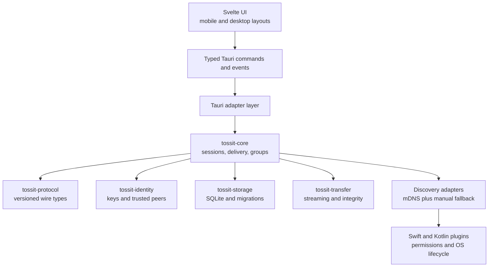

# TossIt Architecture and Implementation Plan

Status: Architecture baseline v0.1

Last updated: 2026-08-11

## 1. Product intent

TossIt is a lightweight local-network messenger for iOS, Android, macOS, and
Windows. People on the same LAN can discover each other and exchange text,
images, and arbitrary files without creating an account or depending on a cloud
service. The product should feel like a restrained, modern LAN-only messenger
rather than a file-transfer utility with chat bolted on.

Core product characteristics:

- No registration, login, phone number, or central user directory.
- A persistent cryptographic device identity survives restarts and IP changes.
- Automatic discovery on ordinary Wi-Fi and Ethernet networks.
- Direct encrypted peer-to-peer communication.
- Private conversations and group conversations.
- Local conversation history and transfer records.
- A compact, modern interface with mobile and desktop layouts.
- AI roles and message analysis are a possible later extension, not part of the
  initial product.

## 2. Approved technical direction

TossIt will begin with Tauri 2 on all four target platforms. The application
logic remains independent of Tauri so mobile UI shells can be replaced with
SwiftUI or Kotlin without rewriting identity, protocol, storage, or transfer
logic if the mobile WebView proves unsuitable.

| Boundary | Decision | Reason |
| --- | --- | --- |
| Application shell | Tauri 2 | Small distribution footprint and one primary UI codebase |
| UI | Thin Svelte/TypeScript static frontend | Fast iteration without moving networking or files into JavaScript |
| Core | Standalone Rust crates | One memory-safe implementation for protocol, identity, transfer, and storage |
| Mobile integration | Narrow Swift and Kotlin Tauri plugins | Use native APIs for permissions, discovery, sharing, and lifecycle only |
| Discovery | mDNS/DNS-SD with manual IP and QR fallback | Multicast is convenient but cannot be assumed to work on every LAN |
| Transport | Direct TCP with TLS 1.3 | Broad LAN compatibility and standard authenticated encryption |
| Identity | Persistent local keypair; device ID derived from the public key | Stable identity without an account or fixed IP address |
| Storage | SQLite owned by the Rust core | Durable local history with predictable migrations |
| File transfer | Streaming binary chunks with bounded buffers | Large files must not pass through or accumulate in the WebView |
| Group delivery | Direct fan-out to online members in the first release | Avoid introducing a hidden coordinator or cloud relay |

The frontend may invoke commands and receive small state or progress events, but
it must never receive entire file payloads. Tauri is an adapter around the core,
not the domain model.

## 3. System architecture



### Target repository layout

```text
TossIt/
├── src/                         # Svelte UI
├── src-tauri/                   # Thin Tauri application adapter
├── crates/
│   ├── tossit-core/             # Application services and session state
│   ├── tossit-protocol/         # Versioned messages and compatibility fixtures
│   ├── tossit-identity/         # Key lifecycle, device ID, and trust state
│   ├── tossit-storage/          # SQLite repositories and migrations
│   └── tossit-transfer/         # Bounded streaming, checksums, resume state
├── plugins/
│   └── tossit-platform/         # Native Swift/Kotlin capabilities when required
├── tests/
│   ├── interoperability/        # Cross-version protocol fixtures
│   └── end-to-end/              # Multi-process LAN scenarios
└── docs/
    └── architecture-and-implementation-plan.md
```

Crates should only be split when their boundary is exercised. The first risk
spike may start with `tossit-core` and `tossit-protocol`, then extract identity,
storage, and transfer modules as those behaviors become real.

## 4. Identity and trust model

1. On first launch, the Rust core generates a device keypair.
2. The private key is stored using the platform secure store where practical.
   The spike may use an owner-only application data file until secure-store
   integration is validated.
3. A short displayable device ID is derived from the full public-key fingerprint.
4. Discovery advertises an alias, protocol version, port, capabilities, and the
   public identity fingerprint. It never advertises a private secret.
5. The first connection uses trust-on-first-use. Users can verify a short code or
   QR code before marking a device as trusted.
6. Later IP and port changes are accepted only when the cryptographic identity
   remains the same.
7. A key change is shown as a new or changed device, never silently accepted as
   the existing identity.

The LAN is treated as hostile. Discovery data is untrusted input, and encrypted
transport does not remove the need for frame limits, timeouts, filename
sanitization, or explicit transfer acceptance.

## 5. Discovery and connectivity

The default path is mDNS/DNS-SD advertising a private TossIt service type.
Automatic discovery is an enhancement, not a single point of failure.

Fallback order:

1. mDNS/DNS-SD discovery.
2. Recently trusted device endpoints.
3. QR code containing a temporary endpoint and identity fingerprint.
4. Manual IP and port entry.

The UI must distinguish these states:

- Nearby and reachable.
- Known but currently offline.
- Discovered but not trusted.
- Network permission denied.
- Multicast unavailable or blocked by AP/client isolation.
- Firewall blocked or connection refused.

Connections use explicit deadlines and reconnect with bounded exponential
backoff. A persistent identity does not mean holding a permanent socket forever;
sessions may reconnect whenever the OS or network changes.

## 6. Messaging model

Every application message has:

- Protocol version.
- Globally unique message ID.
- Conversation ID.
- Sender device ID.
- Sender monotonic sequence within that conversation.
- Creation timestamp.
- Payload type and payload metadata.
- Integrity and acknowledgement state.

The initial payload types are text, image metadata, file metadata, delivery
acknowledgement, group membership change, and protocol error.

Receivers deduplicate by message ID. Acknowledgements make delivery observable,
but the first release only guarantees delivery to members that are online during
the send attempt. Offline relay, distributed history repair, and internet
transport are separate product decisions.

## 7. Group conversations

The first group design remains serverless:

- A group has a random stable group ID and a signed membership record.
- Membership changes are explicit events.
- A sender fans a message out to currently reachable members.
- Each recipient acknowledges independently.
- Local history records which members received the message.
- The group creator is not a mandatory relay or permanent host.

The MVP does not promise offline delivery or conflict-free multi-device history
repair. Those require a replicated log or an elected synchronization peer and
will be designed only after private-message delivery is stable.

## 8. File and image transfer

File contents are streamed in fixed-size chunks between native file handles and
the encrypted transport. The WebView sees only metadata and progress.

Required properties:

- Bounded memory independent of total file size.
- Explicit receiver acceptance unless the sender is trusted and auto-accept is
  enabled.
- Temporary `.part` files followed by an atomic rename after verification.
- Content length limits, free-space checks, filename sanitization, and collision
  handling.
- BLAKE3 or SHA-256 integrity verification.
- Cancellation without leaving an apparently complete file.
- Resume support designed into metadata, but implemented after basic streaming.
- Image previews generated as bounded thumbnails rather than full-resolution IPC
  payloads.

## 9. Platform lifecycle boundaries

### Desktop

- macOS and Windows may remain available from the system tray.
- Firewall and local-network permission failures must produce actionable UI.
- App updates and signing are release concerns, not part of the network core.

### Mobile

- Full availability is guaranteed while the app is foregrounded.
- An in-progress user-initiated transfer may request limited background time.
- iOS cannot be treated as a permanent LAN server after suspension or force-quit.
- Android continuous background listening would require a visible foreground
  service and is not an MVP default.
- Receiving from the OS share sheet is a platform adapter feature.

TossIt will not claim WeChat-like background delivery without a push or relay
service. That limitation is imposed by mobile operating systems, not Tauri.

## 10. Security baseline

- TLS 1.3 only; no silent plaintext fallback.
- Cryptographic device identity is independent of display name and network
  address.
- Private keys never cross the Tauri IPC boundary.
- All protocol frames have strict size limits before allocation.
- Timeouts cover discovery, handshake, idle sessions, and transfers.
- Received paths are normalized and confined to an approved destination.
- Database migrations are transactional and versioned.
- Logs exclude message bodies, private keys, and complete filesystem paths by
  default.
- Dependencies are pinned by lockfiles and updated deliberately.
- Threat modeling and protocol fuzzing are required before public release.

## 11. Implementation plan

### Phase 0 — Repository and toolchain baseline

Deliverables:

- Tauri 2 and Svelte/TypeScript scaffold named TossIt.
- Rust workspace and initial `tossit-core` / `tossit-protocol` crates.
- Locked frontend and Rust dependencies.
- Formatting, linting, unit-test, and build commands.
- Generated target projects where the required platform SDK is available.

Exit evidence:

- Frontend type-check and production build pass.
- Rust format, clippy, and tests pass.
- macOS Tauri application launches from the repository.

### Phase 1 — Four-platform risk spike

Deliverables:

- Persistent device identity.
- Discovery advertisement and browsing.
- Manual endpoint fallback.
- Encrypted direct connection.
- One text message plus acknowledgement.
- Two-process local integration harness.
- Minimal device list and message UI.

Exit evidence:

- Two macOS instances discover one another and exchange encrypted text.
- Identity survives restart while endpoint changes are tolerated.
- At least one physical iOS and one physical Android device complete the same
  exchange before full UI development proceeds.
- Windows builds and completes the exchange on a Windows host.

If Tauri mobile blocks this milestone, retain the Rust core and replace only the
mobile UI shell with SwiftUI/Kotlin.

### Phase 2 — Private conversations

Deliverables:

- Trusted-peer pairing and verification code.
- SQLite schema and migrations.
- Conversation list, text composer, message status, and unread state.
- Deduplication, reconnect, retry, and bounded history queries.

Exit evidence:

- Restart preserves identity, peers, conversations, and messages.
- Duplicate or delayed frames do not duplicate visible messages.
- Denied trust and changed identity are handled safely.

### Phase 3 — Images and files

Deliverables:

- Native file/image picker and share entry points.
- Streaming transfers, progress, cancellation, integrity verification, and
  destination selection.
- Bounded previews and transfer history.

Exit evidence:

- Large-file memory remains bounded.
- Interrupted and cancelled transfers never appear complete.
- Filenames and paths are safe on every platform.

### Phase 4 — Groups

Deliverables:

- Group creation, signed membership, member management, and direct fan-out.
- Per-recipient delivery state.
- Group history and deterministic membership-event ordering.

Exit evidence:

- Three or more devices exchange messages without a permanent coordinator.
- Offline members are visibly marked undelivered rather than silently assumed to
  have received data.

### Phase 5 — Product hardening

Deliverables:

- Restrained responsive UI, dark mode, accessibility, keyboard navigation, and
  desktop tray behavior.
- Permission education and network diagnostics.
- Crash-safe storage, protocol fuzzing, abuse limits, and security review.
- Performance and footprint budgets.

Initial budgets to measure rather than promise:

- Cold launch latency per platform.
- Idle resident memory.
- Release bundle size.
- Discovery time on a normal home LAN.
- Sustained file throughput and peak memory.

### Phase 6 — Distribution

Deliverables:

- macOS notarized build.
- Signed Windows installer.
- iOS App Store archive.
- Android App Bundle and store metadata.
- Privacy disclosures, licenses, update policy, and reproducible release notes.

### Later — AI roles

AI analysis remains outside the initial architecture. Any future implementation
must be optional, visibly enabled, and explicit about whether inference is local
or remote. Message content must never be sent to an AI provider merely because a
role exists in a conversation.

## 12. Verification matrix

| Scenario | macOS | Windows | iOS | Android |
| --- | --- | --- | --- | --- |
| Launch and identity persistence | Required | Required | Required | Required |
| Local-network permission denied | Required | N/A | Required | Required |
| mDNS discovery | Required | Required | Required | Required |
| Manual IP/QR fallback | Required | Required | Required | Required |
| Encrypted text exchange | Required | Required | Required | Required |
| Wi-Fi change and reconnect | Required | Required | Required | Required |
| Large file with bounded memory | Required | Required | Required | Required |
| Background transfer continuation | N/A | N/A | Best effort | Best effort |
| App suspended or killed | Tray behavior | Tray behavior | No delivery promise | No default delivery promise |

Tests are layered:

1. Protocol serialization fixtures and compatibility tests.
2. Rust unit tests for identity, framing, validation, and persistence.
3. Multi-process integration tests on loopback and real LAN interfaces.
4. Tauri command/event contract tests.
5. Physical-device tests for permissions, lifecycle, and file sharing.
6. Signed-package installation and launch tests before release.

## 13. Principal risks and mitigations

| Risk | Mitigation |
| --- | --- |
| Multicast blocked by router or guest Wi-Fi | Manual IP, QR endpoint, diagnostics, remembered peers |
| iOS/Android background suspension | Honest foreground guarantee; finish only active user transfers |
| Tauri mobile integration gaps | Framework-independent Rust core and an explicit native-UI escape hatch |
| Firewall blocks inbound connections | Stable documented port option, detection, and actionable instructions |
| Identity spoofing on an untrusted LAN | Fingerprint-derived ID, TOFU verification, key-change warning |
| Large files exhaust memory or disk | Bounded streaming, free-space checks, temporary files, integrity verification |
| Group state diverges | Keep MVP membership model simple; test deterministic event ordering |
| Dependency and plugin churn | Prefer owned core code, official APIs, lockfiles, and scheduled upgrades |
| Four-platform behavior drifts | Shared protocol fixtures plus physical-device release matrix |

## 14. Reference implementations

The following shipped projects informed the architecture without defining it:

- [LocalSend](https://github.com/localsend/localsend): Flutter application with
  a documented local REST/HTTPS protocol and multiple discovery fallbacks.
- [Flying Carpet](https://github.com/spieglt/FlyingCarpet): Tauri/Rust desktop
  implementation with Kotlin and Swift mobile clients.
- [Readest](https://github.com/readest/readest): Tauri 2 application distributed
  across desktop and mobile platforms.
- [KDE Connect](https://kdeconnect.kde.org/get-involved.html): mature protocol
  with platform-specific desktop, Android, and iOS clients.
- [RustDesk](https://github.com/rustdesk/rustdesk): shared Rust core with a
  cross-platform Flutter UI.

## 15. Current repository state

At this baseline commit, the repository contains the Tauri/Svelte scaffold and
this architecture plan. The Rust networking core, identity model, discovery,
encrypted transport, persistence, file transfer, and product UI remain planned
work. Completion claims must be tied to the exit evidence in each phase above.
